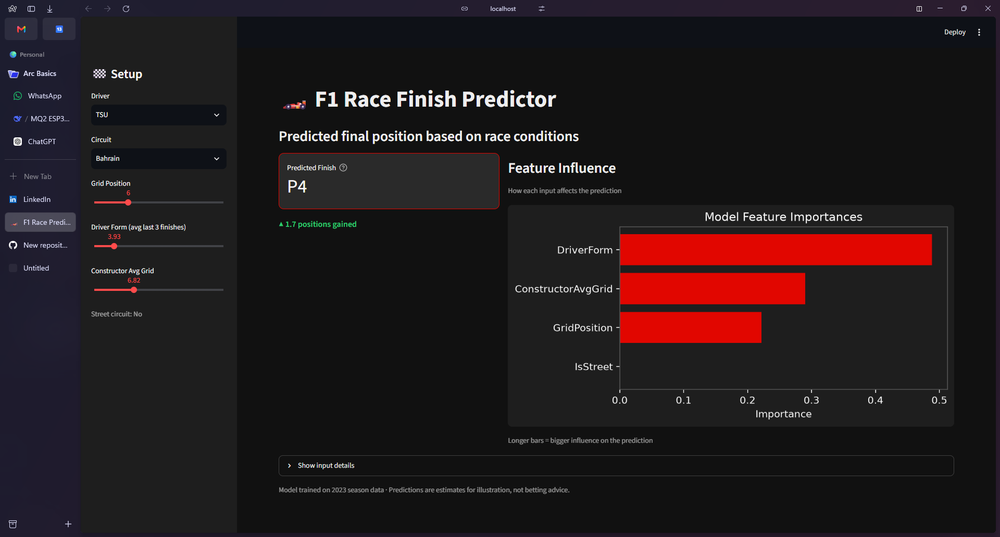

# 🏎️ F1 Race Finish Predictor

Predict Formula 1 race finishing positions using machine learning, based on **grid position**, **driver form**, **constructor pace**, and **circuit type**.  
Built with FastF1, scikit‑learn, and Streamlit.

 <!-- Add a screenshot of your running dashboard here -->

---

## 📖 Table of Contents

- [Features](#-features)
- [How It Works](#-how-it-works)
- [Tech Stack](#-tech-stack)
- [Installation](#-installation)
- [Usage](#-usage)
  - [1. Train the Model](#1-train-the-model)
  - [2. Launch the Dashboard](#2-launch-the-dashboard)
- [Project Structure](#-project-structure)
- [Results](#-results)
- [Future Improvements](#-future-improvements)
- [License](#-license)
- [Acknowledgments](#-acknowledgments)

---

## ✨ Features

- **Real F1 data** – fetches full 2023 season results via the FastF1 API.
- **Feature engineering**:
  - Grid position (starting spot)
  - Driver form (average finish in the last 3 races)
  - Constructor average grid position (team pace indicator)
  - Street circuit flag (Monaco, Singapore, Baku, etc.)
- **Machine learning** – Random Forest Regressor with leave‑one‑race‑out cross‑validation to prevent data leakage.
- **Interactive dashboard** – tweak inputs and see predicted position instantly, with feature importance charts.
- **Baseline comparison** – simple linear regression using only grid position to measure improvement.

---

## ⚙️ How It Works

1. **Data collection** – loops over every 2023 Grand Prix, extracts results, and calculates rolling driver form.
2. **Model training** – trains a Random Forest on the full dataset, evaluates with cross‑validation.
3. **Prediction** – the Streamlit app takes user inputs (driver, circuit, grid position, etc.) and outputs the predicted finishing position.

---

## 🛠️ Tech Stack

| Tool/Library      | Purpose                              |
| ----------------- | ------------------------------------ |
| **FastF1**        | Fetch official F1 session data       |
| **Pandas / NumPy**| Data manipulation & feature creation |
| **scikit‑learn**  | Random Forest, cross‑validation, metrics |
| **Streamlit**     | Interactive web dashboard            |
| **Matplotlib**    | Feature importance visualisation     |
| **Joblib**        | Model persistence (save/load)        |

---

## 📦 Installation

### Prerequisites
- Python 3.9 or higher
- Git (optional, for cloning)

### Clone the repository
```bash
git clone https://github.com/yourusername/f1-race-predictor.git
cd f1-race-predictor